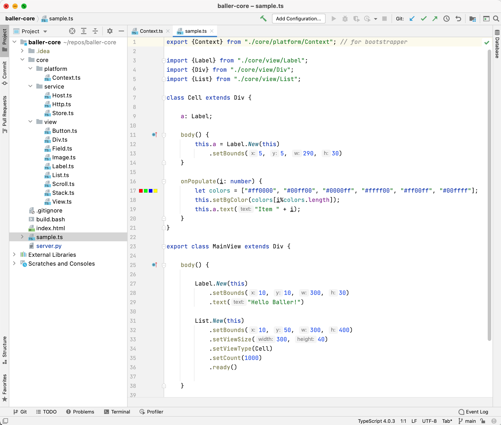

# Baller Views (Alpha 0.0.3)


## Getting Started Guides for the 3 Baller Platforms:

Android: [https://github.com/bradedelman/baller-android](https://github.com/bradedelman/baller-android)

iOS: [https://github.com/bradedelman/baller-ios](https://github.com/bradedelman/baller-ios)

Web: [https://github.com/bradedelman/baller-web](https://github.com/bradedelman/baller-web)

## Getting Started with Writing Views 
Now that you've seen the sample running on Android, iOS and Web, let's take a look at the sample View itself and learn how we can edit, transpile and run.

1. Install the TypeScript Transpiler

	First, you need to be sure you have "node"...
	If not, you can install with HomeBrew
	
	````
	brew install node
	node --version                      // to confirm it's there
	````
	
	Once you have node, you can use node to install TypeScript:
	
	````
	npm install -g typescript
	tsc --version	                     // to confirm it's there
	````
	
2. Find out your local IP address, so you can point clients at a local server.  

	Lot's of ways to find out... if you're on WIFI, you can use a little script included in the repo:
	
	````
	bradedelman@Brad baller-core % bash show_wifi_IP.bash 
	10.0.0.97
	````
	
	In the examples below, where you see YOUR_IP, use your IP.
	
3. Start the Local Transpile Server


	To make it easy to iterate, we use a simple local Python server that knows how to run the TypeScript compiler and serve the results.
	
	````
	cd baller-core          (wherever you cloned it)
	python3 server.py       (python3 should already be installed on OSX)
	
	when it starts, it will print to the console
	
	Starting Baller Transpile Server on Port 3000...	
	````

4. Let's modify 1 or more sample apps to use the locally served script.  Basically, we just need to update the URL for where to get the script (note the change from https to http as well):

	````
	Android
	
	in MainActivity, change:
   val contents = URL("https://www.cleverfocus.com/baller/sample.js").readText()
   to
   val contents = URL("http://YOUR_IP:3000/sample.js").readText()
	````   

	````
	iOS

	in ViewController, change:
   if let url = URL(string: "https://www.cleverfocus.com/baller/sample.js") {
	to
   if let url = URL(string: "http://YOUR_IP:3000/sample.js") {
	````
	
	````
	Web
	
	in index.html, change:
	baseUrl: 'https://www.cleverfocus.com/baller/'
	to
	baseUrl: 'http://YOUR_IP:3000/'
	change
	````
	
5. Now run and see that everything is the same as before (list of 1,000 items). Yay! Ok, now let's try some changes to the view.	
6. Open the sample code.  While technically, you could just edit sample.ts in any text editor, I recommend opening the baller-core directory as a Project in IntelliJ.  IntelliJ understand TypeScript and will provide syntax checking, coloring, code validation, etc.

	Once it is open, you can select the sample.ts file and you should see this:

	 

7. 	Let's make a simple change.  Change "Hello Baller" to "Hello World"

8. Ok, refresh index.html (or re-run your iOS/Android app) - it's changed!

	Obviously, hitting refresh in the brower is fastest/easiest.  In fact, the reason the Web Platform is supported for this Framework which is meant for Android/iOS is for development velocity and quick iterations.

### That's it!  Easy iterations :-)  Docs coming soon on the View types and richer examples.